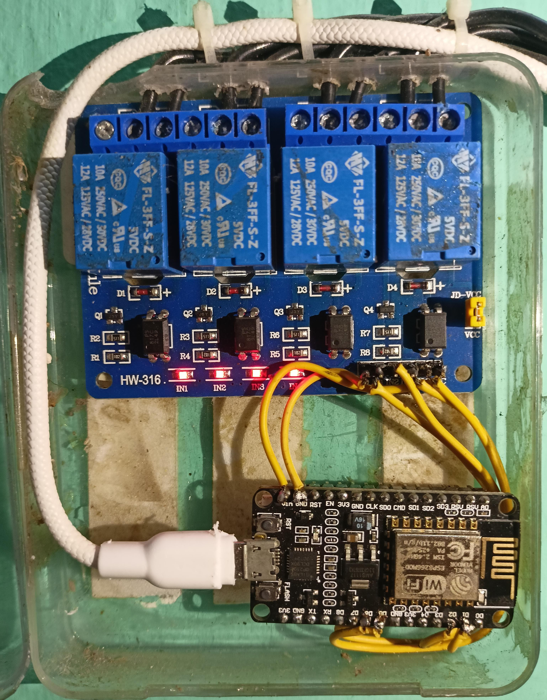
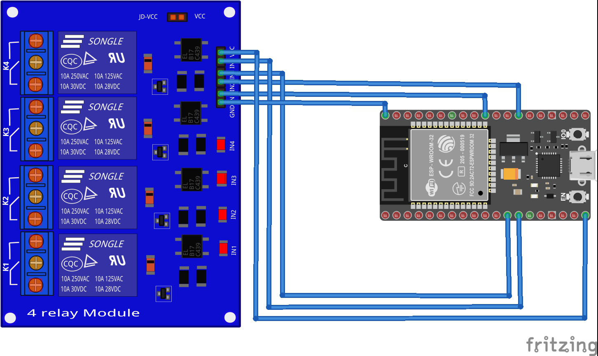

# 🔌 Smart Home Automation using ESP32 and 4-Channel Relay

A simple IoT-based home automation system that allows users to control up to 4 electrical appliances (like fans, lights) using the Blynk mobile app and ESP32 Wi-Fi microcontroller.

---

## 📱 Features

- Control 4 appliances wirelessly from your smartphone
- Uses ESP32 for Wi-Fi connectivity
- Real-time control using Blynk IoT app
- Compact and cost-effective
- Scalable and customizable

---

## 📷 Demo



---

## 🔧 Components Used

- ESP32 Dev Board
- 4-Channel Relay Module
- Blynk IoT App
- 5V Power Supply
- Switchboard with appliances

---

## 🖥️ Circuit Diagram



---

## 🧠 How It Works

1. ESP32 connects to Wi-Fi and Blynk cloud.
2. User sends control commands from the Blynk mobile app.
3. ESP32 receives commands and toggles GPIO pins.
4. Relay module switches the corresponding AC appliances.

---

## 🧾 Code

```cpp
#define BLYNK_TEMPLATE_ID "YourTemplateID"
#define BLYNK_DEVICE_NAME "SmartHome"
#define BLYNK_AUTH_TOKEN "YourAuthToken"

#include <WiFi.h>
#include <WiFiClient.h>
#include <BlynkSimpleEsp32.h>

// Replace with your WiFi credentials
char ssid[] = "YourWiFiSSID";
char pass[] = "YourWiFiPassword";

void setup() {
  Blynk.begin(BLYNK_AUTH_TOKEN, ssid, pass);
  for (int i = 12; i <= 15; i++) {
    pinMode(i, OUTPUT); // GPIO 12 to 15 for 4 relays
  }
}

BLYNK_WRITE(V0) { digitalWrite(12, param.asInt()); }
BLYNK_WRITE(V1) { digitalWrite(13, param.asInt()); }
BLYNK_WRITE(V2) { digitalWrite(14, param.asInt()); }
BLYNK_WRITE(V3) { digitalWrite(15, param.asInt()); }

void loop() {
  Blynk.run();
}
